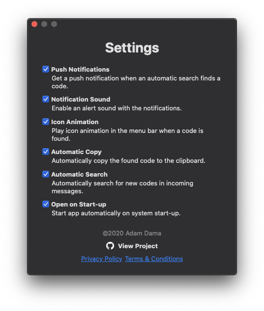

# OneTimeCopy
A small menu bar app to automatically copy any one-time passcodes from macOS Messages to your clipboard. 

[Safari on macOS](https://support.apple.com/guide/safari/autofill-security-codes-from-your-iphone-ibrwa4a6c6c6/mac) and [iOS](https://support.apple.com/guide/iphone/automatically-fill-in-sms-passcodes-on-iphone-iphc89a3a3af/ios) have the capability to copy any one-time passcodes automatically from your messages into a text field when you receive them. This app extends that capability beyond Safari to any system-wide app since it copies the code to the clipboard, allowing you to use the code in other browsers such as Chrome. 

OneTimeCopy does not store or transmit any one-time codes or any processed Messages. All processing is done locally on your device.

## Features
 - Push notifications
 - Copy code from notification
 - Enable/disable notification sound
 - Automatic detection
 - Automatic copying 
 - Small menu bar footprint
 - Menu bar icon animation on detection
 - Light and dark themes

## Requirements

 - macOS 10.15 Catalina or newer
 - [Text Message Forwarding](https://support.apple.com/en-us/HT208386) set up on your iPhone/Mac 
 - Enable Full Disk Access

## Screenshots

| | Light Mode | Dark Mode |
|--|--|--|
| Menu bar icon | 
 | 
 |
| Main view | 
 | 
 |
| Permissions | 
 | 
 |
| Settings | 
 | 
 |

#### © 2020 Adam Dama

